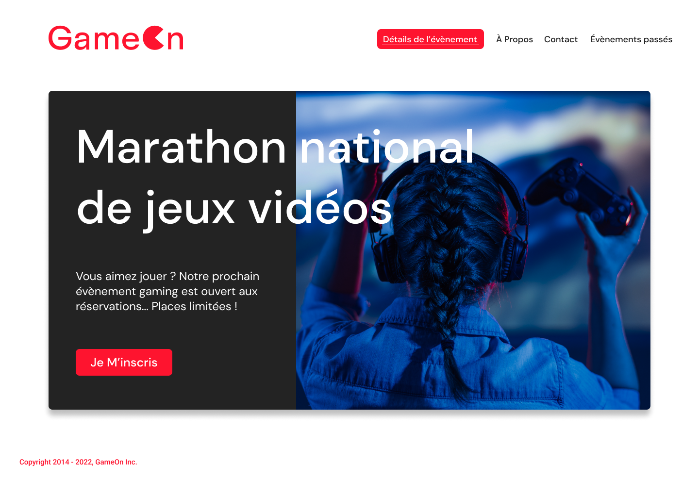

# GameOn

![html][html5-badge]
![css][css3-badge]
![javascript][javascript-badge]
![vscode][vscode-badge]
![w3c][w3c-badge]

## Description

Vous avez récemment été embauché comme développeur Front-End junior dans une PME, GameOn, spécialisée dans les conférences et les concours de jeux.

Jason, qui a démissionné récemment, avait commencé à travailler sur la structure HTML et le style CSS, sur la base de la maquette suivante :

Il avait terminé la mise en page et le contenu de la page d'accueil ainsi que de la modale du formulaire. Il a également ajouté le JavaScript pour le lancement de la maquette.

Votre travail consiste à ajouter le code JavaScript manquant pour que le formulaire soit pleinement fonctionnel.

## Compétences évaluées

- Programmer en JavaScript

## Contact

Vinodh Zamboulingame

[![linkedin][linkedin-badge]][linkedin-url]
[![github][github-badge]][github-url]

<a href="#readme-top">back to top</a>

<!-- BADGE LINKS -->

[html5-badge]: https://img.shields.io/badge/HTML5-E34F26?style=for-the-badge&logo=html5&logoColor=white
[css3-badge]: https://img.shields.io/badge/CSS3-1572B6?style=for-the-badge&logo=css3&logoColor=white
[javascript-badge]: https://img.shields.io/badge/JavaScript-323330?style=for-the-badge&logo=javascript&logoColor=F7DF1E
[vscode-badge]: https://img.shields.io/badge/Made%20with-VSCode-1f425f.svg?style=for-the-badge&logoColor=white
[w3c-badge]: https://img.shields.io/w3c-validation/default?style=for-the-badge&logoColor=white&targetUrl=https%3A%2F%2Fgameon-vza.netlify.app
[linkedin-badge]: https://img.shields.io/badge/LinkedIn-0077B5?style=for-the-badge&logo=linkedin&logoColor=white
[linkedin-url]: https://www.linkedin.com/in/vzamboulingame
[github-badge]: https://img.shields.io/badge/GitHub-0a0a0a?style=for-the-badge&logo=github&logoColor=white
[github-url]: https://github.com/vzamboulingame
